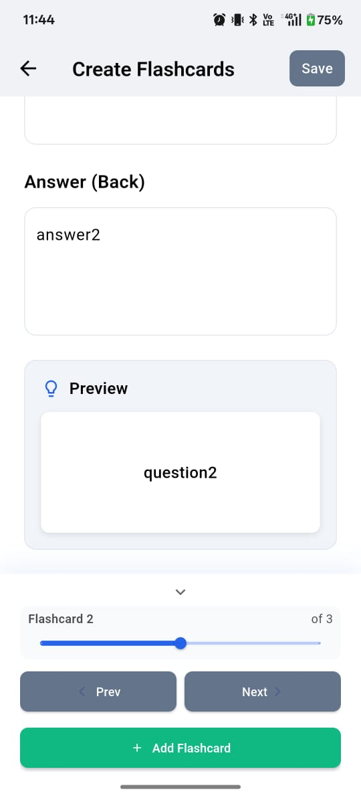
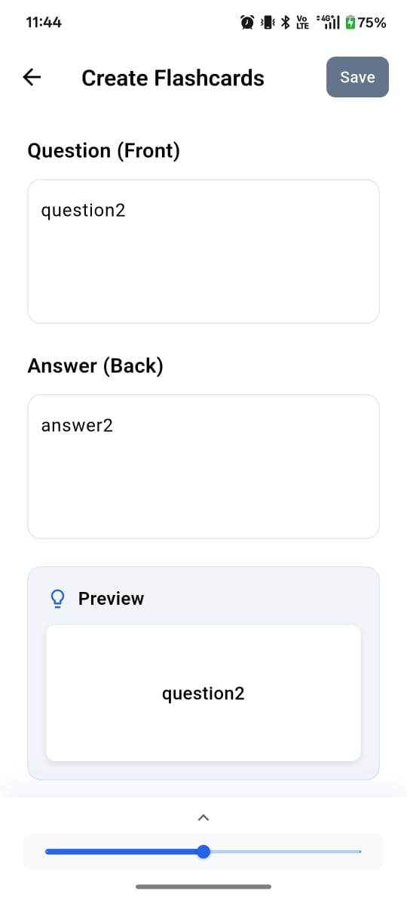
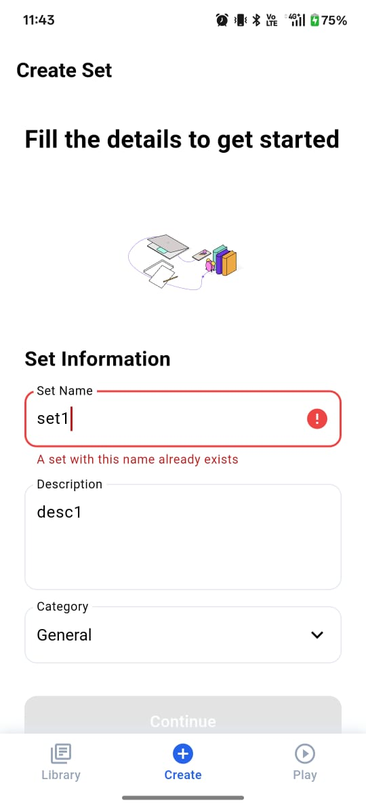
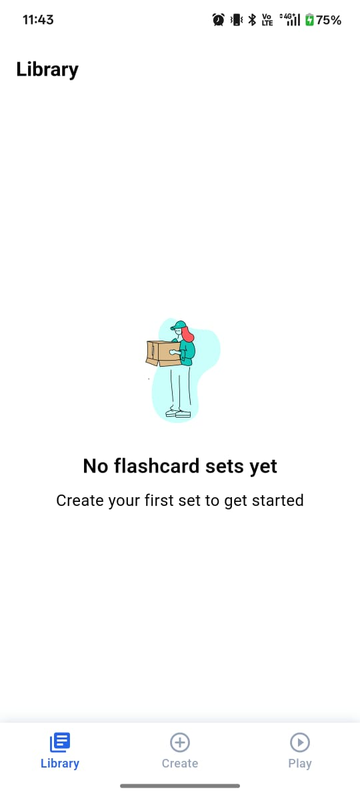
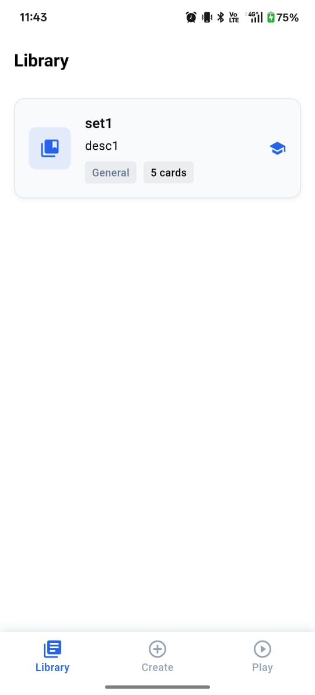
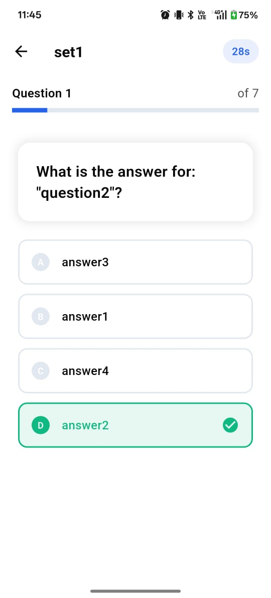
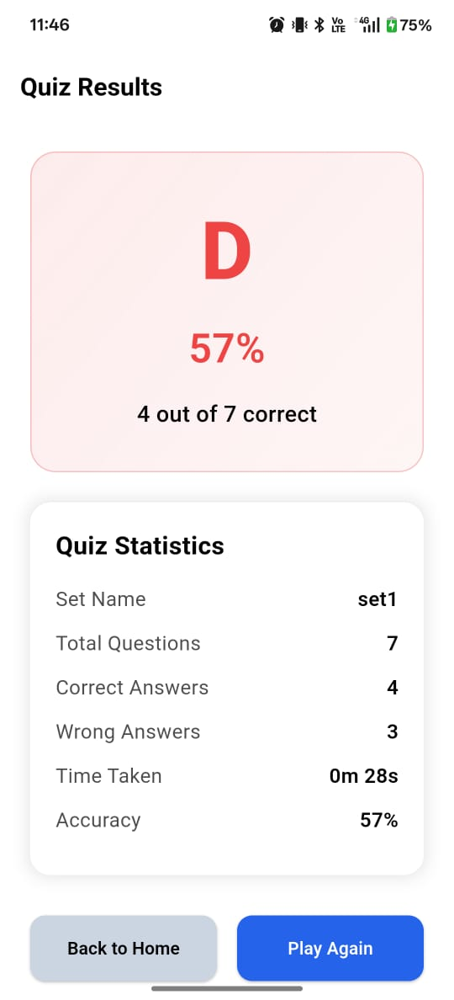
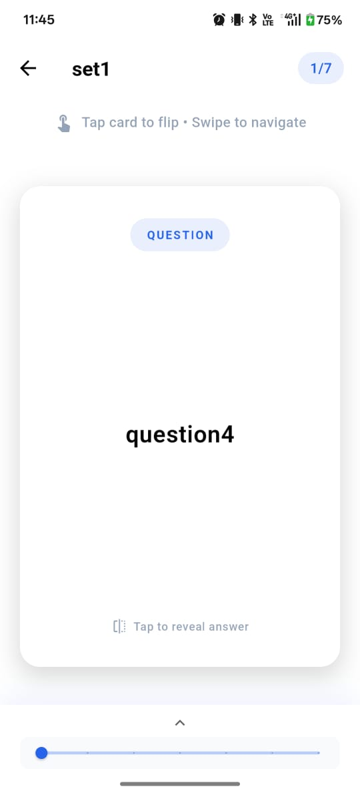

# 🚀 FlashyCards

> **A beautiful, intuitive flashcard learning app built with Flutter that makes studying engaging and fun!**

---

## ✨ Features

### 🎯 Core Functionality
- **📚 Create Custom Flashcard Sets** - Build personalized study collections with ease  
- **🎮 Interactive Quiz Mode** - Test your knowledge with timed multiple-choice quizzes  
- **🔄 Smart Card Flipping** - Tap to flip between questions and answers with smooth animations  
- **📊 Progress Tracking** - Monitor your learning progress with beautiful visual indicators  
- **🏷️ Category Organization** - Organize flashcards by subjects (Math, Science, History, etc.)  

### 🎨 Beautiful Design
- **✨ Lottie Animations** - Delightful micro-interactions throughout the app  
- **🎭 Smooth Transitions** - Fluid navigation and state changes  
- **🌟 Modern UI/UX** - Clean, intuitive interface following Material Design principles  
- **🎨 Visual Feedback** - Haptic feedback and animated confirmations  

### 🔧 Advanced Features
- **⚡ Real-time Validation** - Duplicate name checking with instant feedback  
- **🗑️ Multi-select Delete** - Long-press to select and delete multiple sets  
- **⏱️ Timed Quizzes** - 30-second countdown per question for added challenge  
- **📈 Detailed Results** - Comprehensive quiz statistics and performance tracking  
- **💾 Local Storage** - All data stored locally using Hive database  

---

## 📱 Screenshots

### ➕ Create Flashcards
  
  

### 🗂️ Create a Set
  

### 📚 Library
  
  

### 🎯 Quiz
  

### 📈 Results
  

### 👓 View Flashcards
  

---

## 🚀 Getting Started

### Prerequisites
- Flutter SDK 3.0 or higher  
- Dart SDK 3.0 or higher  
- Android Studio / VS Code with Flutter extension  

### Installation

1. **Clone the repository**
git clone https://github.com/ChauhanKrish4763/FlashcardsApp.git
cd FlashcardsApp

3. **Add Lottie animations**
- Create `assets/animations/` folder
- Add your Lottie JSON files:
  - `loading.json` - Loading animations
  - `empty_box.json` - Empty state animations
  - `success_confetti.json` - Success feedback
  - `error_occurred.json` - Error feedback
  - `trashcan.json` - Delete actions
  - `create.json` - Create set placeholder

4. **Update pubspec.yaml**
flutter:
assets:
- assets/animations/

5. **Run the app**
flutter run

## 🏗️ Architecture

FlashyCards follows a clean, scalable architecture:

lib/
├── models/ # Data models (Flashcard, FlashcardSet, QuizQuestion)
├── providers/ # State management with Riverpod
├── screens/ # UI screens and pages
├── services/ # Business logic and data services
├── utils/ # Utilities and constants
└── widgets/ # Reusable UI components

### 🛠️ Tech Stack
- **Framework**: Flutter 3.0+
- **State Management**: Riverpod
- **Local Database**: Hive
- **Animations**: Lottie + Custom Flutter animations
- **Architecture**: Provider pattern with clean separation of concerns

## 🎮 How to Use

### Creating Flashcard Sets
1. Tap the **"Create"** tab in the bottom navigation
2. Fill in set details (name, description, category)
3. Add flashcards with questions and answers
4. Save your set to start learning!

### Learning Mode
1. Go to **"Library"** and select a flashcard set
2. Tap cards to flip between questions and answers
3. Swipe left/right to navigate between cards
4. Track your progress as you learn

### Quiz Mode
1. Navigate to **"Play"** tab
2. Select a set with at least 4 cards
3. Answer multiple-choice questions within 30 seconds
4. Review your results and improve your score!

### Managing Sets
- **Long press** any flashcard set to enter selection mode
- **Delete multiple sets** using the trash icon in the app bar
- **Real-time search** and organization by categories

## 🎨 Customization

### Adding Custom Animations
1. Create or download Lottie animations from [LottieFiles](https://lottiefiles.com/)
2. Add JSON files to `assets/animations/`
3. Update the file paths in the relevant screen files

### Theming
Customize the app's appearance by modifying `lib/utils/app_colors.dart`:

## 📝 License
**This project is licensed under the MIT License**
